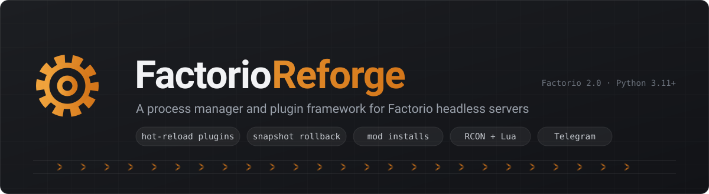

<p align="center">
  
</p>

<p align="center">
  
  
  
  
  
</p>

<p align="center">
  <b>English</b> · <a href="README_zh.md">简体中文</a>
</p>

---

**FactorioReforge runs your Factorio headless server and lets you manage it from
in-game chat, from your terminal, or from Telegram.**

It owns the server process, turns its output into structured events, and hands
those to plugins. Twenty-two plugins ship with it: slot-based backups with a
one-command restore, Telegram control, mod installs from the portal, a rendered
world map, crash diagnosis, a blueprint library, production charts and more.

In the shape of [MCDReforged](https://github.com/MCDReforged/MCDReforged), which
does this for Minecraft. Verified against **Factorio 2.0.77** headless on Linux.

```
14:02:11 INF reforge        Loaded 13 plugin(s)
14:02:14 INF factorio       Hosting game at IP ADDR:({0.0.0.0:34197})
14:02:16 INF reforge        Startup check: 0 problem(s), 2 notice(s), 3 routine
14:02:31 INF factorio       2026-08-02 14:02:31 [JOIN] Alice joined the game
14:02:48 INF factorio       2026-08-02 14:02:48 [CHAT] Alice: !!qb make before biters
14:02:48 INF save           Backed up into slot 1 (24.1 MB, 0.4s)
```

---

## Quick start

```bash
git clone https://github.com/steven12138/FactorioReforge.git
cd FactorioReforge
./scripts/install.sh          # downloads Factorio, makes a map, builds .venv, writes config.yml
./scripts/run.sh
```

Then connect from the game — **Multiplayer → Connect to address →
`127.0.0.1:34197`** — and type `!!FR help` in chat or in the terminal.

Already have a headless server? `./scripts/install.sh --no-server` sets up only
the Python side, and [Configuration](docs/configuration.md) covers pointing it
at your install.

**New to Factorio servers?** The [tutorial](docs/TUTORIAL.md) goes from a bare
machine to Telegram control in thirteen sections, every command run on a real
server.

## Documentation

| | |
|---|---|
| [**Tutorial**](docs/TUTORIAL.md) | Step by step from nothing to a running, managed server |
| [**Commands**](docs/commands.md) | Every command, what it does, who may run it |
| [**Configuration**](docs/configuration.md) | `config.yml`, and what it refuses to start with |
| [**Plugins**](docs/plugins.md) | The bundled plugins and their settings |
| [**Writing plugins**](docs/writing-plugins.md) | Events, the server API, storage, translations |
| [**Running a Factorio server**](docs/factorio-server.md) | Headless servers on their own, without any of this |
| [**Architecture**](docs/architecture.md) | How it works inside, and why it works that way |
| [**Factorio notes**](docs/factorio-notes.md) | Behaviour measured on a real 2.0.77 server |
| [**Contributing**](CONTRIBUTING.md) | Tests, style, what a change should come with |
| [**Changelog**](CHANGELOG.md) | What has changed |

## What it does

**Owns the process.** Start, graceful stop, crash detection, optional
auto-restart. Ctrl-C stops Factorio first and waits for it to exit, so no tick
is lost to an impatient shutdown.

**Reads the server.** Every line of Factorio's stdout is parsed into an event —
joins, leaves, chat, deaths, the engine's own log — and dispatched to plugins.
Nothing is scraped twice.

**Two channels, on purpose.** Chat and admin commands go over stdin, which is
always available and needs no port. Anything with a *result* — the player list,
a Lua expression, a private message — goes over RCON, wrapped in
`helpers.table_to_json` so plugins get real Python data instead of scraped text.

**Commands from anywhere.** `!!`-prefixed commands work from the console, from
in-game chat and from Telegram, behind a five-level permission model.

**Backups you can undo.** The slot model is
[QuickBackupM](https://github.com/TISUnion/QuickBackupM)'s, which has been doing
this on Minecraft servers for years. Restoring copies the current world aside
first, so restoring the wrong slot is recoverable.

**Never cheats.** Everything FactorioReforge runs goes through `/sc`
(silent-command), never `/c`, so your world is never flagged as cheated — and a
test greps the whole tree to keep that true.

**Speaks your language.** English and Simplified Chinese throughout, logs
included. Each plugin ships its own translations.

## Bundled plugins

| Plugin | What it gives you |
|---|---|
| [`save_guard`](docs/plugins.md#save-management) | `!!qb` — slot backups, staged restore, undo |
| [`auto_snapshot`](docs/plugins.md#auto_snapshot) | Backups on a timer and when the last player leaves |
| [`telegram_bridge`](docs/plugins.md#telegram_bridge) | Chat relay and full server control from your phone |
| [`mod_manager`](docs/plugins.md#mod_manager) | Search, install and update mods from the portal |
| [`version_manager`](docs/plugins.md#version_manager) | `!!version` — change the Factorio build, and get back if it goes wrong |
| [`map_render`](docs/plugins.md#map_render) | `!!map` — the world drawn at one pixel per tile |
| [`crash_doctor`](docs/plugins.md#crash_doctor) | Names the cause when the server dies, and the fix |
| [`server_admin`](docs/plugins.md#server_admin) | `!!server` — edit `server-settings.json` from chat |
| [`server_utils`](docs/plugins.md#server_utils) | `!!here` `!!info` `!!list` `!!seen` `!!stats` `!!tp` |
| [`warp`](docs/plugins.md#warp) | Named, clickable, pinned map locations |
| [`blueprints`](docs/plugins.md#blueprints) | A shared server-side blueprint library |
| [`calculator`](docs/plugins.md#calculator) | `==1+1`, and `!!ratio` — machines, belts and power to build anything |
| [`ups_watch`](docs/plugins.md#ups_watch) | `!!ups` — the update rate, and what is eating it |
| [`alerts`](docs/plugins.md#alerts) | Attacks and in-game alerts, including with nobody online |
| [`trains`](docs/plugins.md#trains) | `!!trains` — no-path and stuck trains |
| [`power`](docs/plugins.md#power) | `!!power` — accumulator charge before the brownout |
| [`research`](docs/plugins.md#research) | `!!research` — see and change the lab queue |
| [`vote`](docs/plugins.md#vote) | `!!vote` — put a question to the players |
| [`mail`](docs/plugins.md#mail) | `!!mail` — messages for players who are offline |
| [`production`](docs/plugins.md#production) | Production history that outlives a session |
| [`world_watch`](docs/plugins.md#world_watch) | Evolution, pollution, research and rocket alerts |
| [`leaderboard`](docs/plugins.md#leaderboard) | `!!top` — playtime, kills, production |
| [`join_motd`](docs/plugins.md#join_motd) | A greeting built from live world data |
| [`web_panel`](docs/plugins.md#web_panel) | A read-only status page with the map and charts |

Writing your own is a file in `plugins/` — see
[Writing plugins](docs/writing-plugins.md).

## Requirements

- Linux, Python **3.11+**
- A Factorio **headless** server (`install.sh` downloads one)
- Optional: `prompt_toolkit` for a console that logs never interrupt,
  `python-telegram-bot` for Telegram

## Project layout

```
factorio_reforge/    the framework
├── core/            process, output parsing, events, RCON, console
├── plugin/          loading, events, the plugin-facing API
├── command/         command tree and dispatch
├── permission/      five levels, persisted
└── saves/           slots, backup, restore
plugins/             the bundled plugins, one package each
config/              per-plugin configuration
snapshots/           backup slots
```

## License

MIT — see [LICENSE](LICENSE).

Built with reference to [MCDReforged](https://github.com/MCDReforged/MCDReforged)
and [QuickBackupM](https://github.com/TISUnion/QuickBackupM), whose designs this
follows deliberately. Factorio is a trademark of Wube Software; this project is
not affiliated with them.
